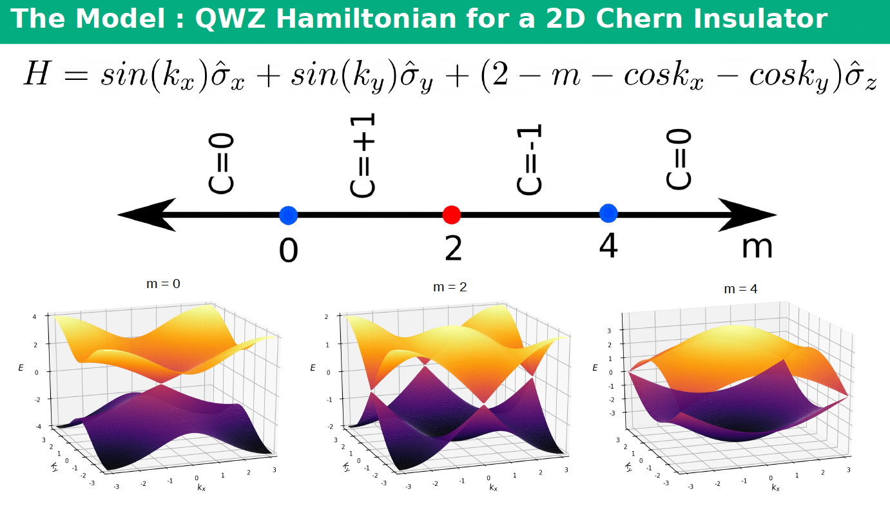

# LyapunovExponents.jl

A Julia package for calculating Lyapunov spectra of disordered lattice systems using transfer matrix methods.


The calculation is parallelised using Julia's `Distributed.pmap`, which dynamically distributes independent jobs among available workers.

Each job corresponds to a single parameter set:

\[
(m, W, L_y)
\]

where:

- `m` : system parameter
- `W` : disorder strength
- `Ly` : transverse system size

The longitudinal system size is defined as:

\[
N_x = \mathrm{scale} \times L_y
\]


<p align="center">
  
</p>

---

## Project Structure

```
LyapunovExponents/
│
├── Project.toml
├── README.md
│
├── src/
│   ├── LyapunovExponents.jl
│   ├── hopping.jl
│   ├── transfer_matrix.jl
│   └── System_parameters.jl
│
├── scripts/
│   ├── main_cheops.jl
│   ├── main_ssh.jl
│   └── perform_job.jl
│
├── jobs/
│   ├── create_jobs_cheops.jl
│   └── create_jobs_ssh.jl
│
├── bin/
│   └── job_list.txt
│
└── test/
    └── runtests.jl
```

---

# Installation

Clone the repository:

```bash
git clone <repository-url>
cd LyapunovExponents
```

Activate the Julia environment:

```bash
julia --project=.
```

Install dependencies:

```julia
using Pkg
Pkg.instantiate()
```

---

# Creating Jobs

Jobs are defined in `job_list.txt`.

Each row corresponds to one independent calculation:

```
jobID    m       W       Ly      scale
1        2.0     5.9     20      100000
2        2.0     6.0     20      100000
...
```

The job list can be generated using:

```
jobs/create_jobs_cheops.jl
```

or:

```
jobs/create_jobs_ssh.jl
```

The generated file is stored in:

```
bin/job_list.txt
```

---

# Running Calculations

## CHEOPS Cluster (SLURM)

Generate the job list and SLURM submission scripts:

```bash
julia --project=. jobs/create_jobs_cheops.jl
```

Submit the generated SLURM scripts.

Each SLURM task runs:

```bash
julia --project=. scripts/main_cheops.jl \
     num_workers \
     start_job_index \
     stop_job_index
```

where:

- `num_workers` = number of Julia workers created
- `start_job_index` = first job index
- `stop_job_index` = last job index

Example:

```bash
julia --project=. scripts/main_cheops.jl 8 1 100
```

This runs jobs `1`–`100` using 8 workers.

---

## SSH Cluster

For SSH-based distributed calculations:

```bash
julia --project=. scripts/main_ssh.jl \
     num_workers \
     start_job_index \
     stop_job_index
```

The available machines are supplied through the SSH worker configuration.

---

# Output

Results are written inside the `bin/` directory.

After a calculation:

```
bin/
│
├── l_list/
│   └── lyaps_<jobID>
│
├── Q_prev/
│   └── Qprev_<jobID>
│
├── R/
│   └── R_<jobID>
│
└── JOB_RUN_LOG.txt
```

## Lyapunov Spectrum

The file:

```
l_list/lyaps_<jobID>
```

contains the Lyapunov spectrum:

\[
\lambda_1,\lambda_2,\dots,\lambda_{2r}
\]

for the corresponding `(m, W, Ly)` parameter set.

## QR Data

The files:

```
Q_prev/
R/
```

store the final QR decomposition matrices used during transfer-matrix iteration.

---

# Parallelisation

The project uses:

```julia
Distributed.pmap
```

Jobs are dynamically assigned to workers:

```julia
pmap(job -> perform_job(job, bin_dir),
     start_index:stop_index)
```

Each worker:

1. Reads one row from `job_list.txt`
2. Constructs the system matrices
3. Calculates the Lyapunov spectrum
4. Writes output files
5. Records execution information in `JOB_RUN_LOG.txt`

---

# Testing

Run the package tests:

```bash
julia --project=. -e "using Pkg; Pkg.test()"
```

---

# Main Components

## `hopping.jl`

Constructs:

- hopping matrices
- clean onsite matrices
- block structures for the supercell

---

## `transfer_matrix.jl`

Computes the Lyapunov spectrum using:

- Green function construction
- transfer matrix iteration
- QR decomposition stabilisation

---

## `System_parameters.jl`

Defines model-specific matrices:

\[
J_x, J_y, M
\]

and numerical parameters.

---

# Authors

Ankita Negi, Vatsal Dwivedi

Institute of Theoretical Physics, University of Cologne (2019)

---

# References

Kunst, F. K., & Dwivedi, V. (2019).  
*Non-Hermitian systems and topology: A transfer-matrix perspective.*  
Physical Review B, 99(24).

DOI: https://doi.org/10.1103/physrevb.99.245116
