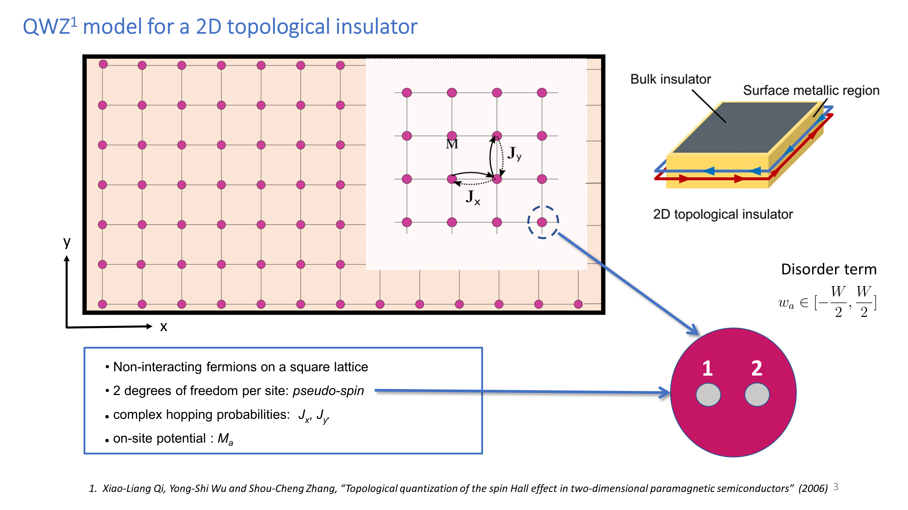
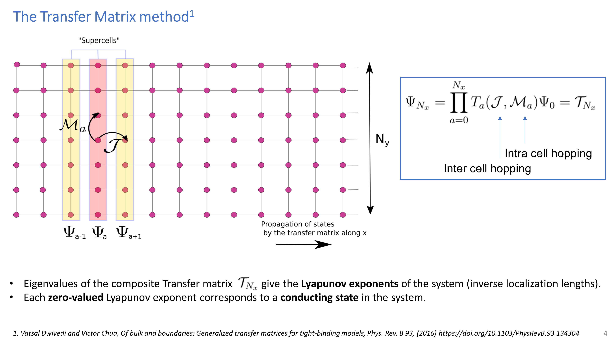
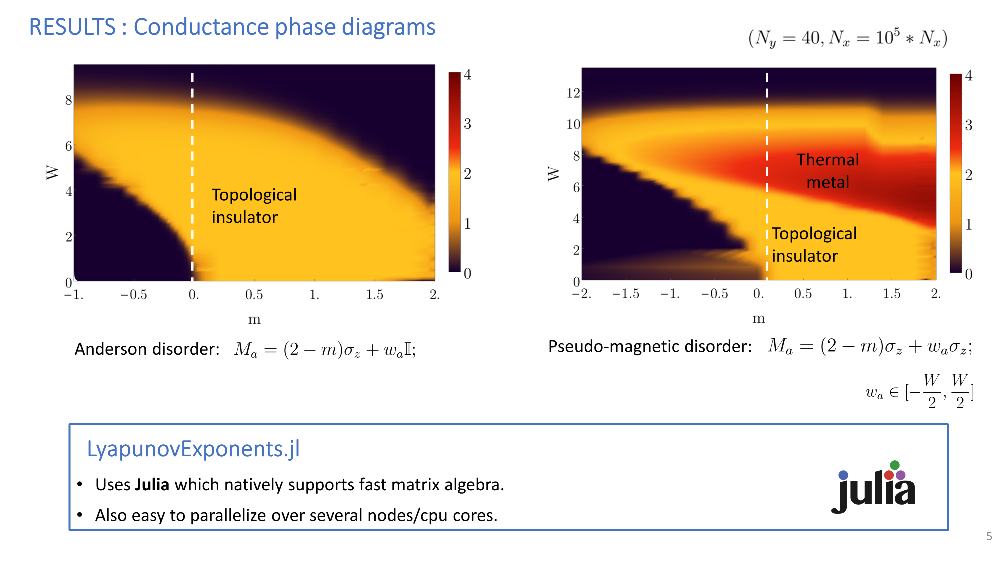

# LyapunovExponents.jl

Julia package for calculating Lyapunov spectra of disordered tight-binding models using transfer-matrix methods [1].

---
## Introduction

This Julia package implements stabilized transfer-matrix calculations for obtaining the Lyapunov spectrum of disordered lattice systems. The systems are treated as quasi-one-dimensional strips with transverse system size ($L_y$) and longitudinal system size

$$
N_x = \mathrm{scale}\times L_y.
$$

For a given set of model parameters:

$$(m, W, L_y)$$

where:

- $m$ : system parameter
- $W$ : disorder strength
- $L_y$ : transverse system size

the transfer matrix is iterated along the longitudinal direction. Repeated QR decompositions are used to stabilize the numerical calculation and extract the Lyapunov spectrum

$$
\lambda_1,\lambda_2,\ldots,\lambda_{2r}
$$

The resulting Lyapunov exponents provide information about the localization properties of the system. In particular, the smallest positive Lyapunov exponent,


$$\lambda_{\min},$$

is related to the quasi-one-dimensional localization length through

$$
\xi \sim \frac{1}{\lambda_{\min}}.
$$

This allows the numerical results to be used to investigate localization, disorder-driven transitions, and finite-size scaling.

The calculations are designed for large-scale parameter sweeps and can be distributed across multiple CPUs or cluster nodes using Julia's `Distributed.pmap`.

---
## Results

### Example: Qi-Wu-Zhang Chern Insulator

As an example application, we consider the **Qi-Wu-Zhang (QWZ) model** [2], a minimal two-band tight-binding model describing a two-dimensional Chern insulator on a square lattice. The model consists of two orbitals per lattice site and is characterized by the Bloch Hamiltonian

$$
H(\mathbf{k}) =
\sin(k_x)\sigma_1
+
\sin(k_y)\sigma_2
+
(2-m-\cos(k_x)-\cos(k_y))\sigma_3 .
$$

Here, the Pauli matrices $\sigma_i$ act in the orbital space, while the parameter $m$ controls the band inversion and determines the topological phase of the system.

The QWZ model exhibits topological phase transitions as the mass parameter $m$ is varied. The bulk energy gap closes at high-symmetry points for

$$
m=0,2,4,
$$

where the Chern number changes. Between these gap-closing points, the system realizes Chern insulating phases with non-zero Chern number, while outside these regions the system is topologically trivial.

<p align="center">
  
</p>


We study how disorder modifies the localization properties of the QWZ Chern insulator by calculating the Lyapunov spectrum using transfer-matrix methods. We consider two types of onsite disorder.

### 1. Anderson disorder

The conventional Anderson disorder is introduced by adding a random scalar potential,

$$
H_{\mathrm{dis}}=\sum_i w_i\sigma_0 ,
$$

where $w_i$ is independently sampled from a uniform distribution with

$$ \langle w_i\rangle =0,\qquad
\mathrm{Var}(w_i)=\frac{W^2}{12}.
$$

This disorder modifies the local chemical potential while preserving the orbital structure of the Hamiltonian.

### 2. Pseudomagnetic disorder

The pseudomagnetic disorder is introduced through a random mass term,
$$
H_{\mathrm{dis}}=\sum_i w_i\sigma_3 .
$$
This perturbation directly modifies the local mass term responsible for band inversion and therefore affects the topological properties of the system.

<p align="center">
  
</p>

<p align="center">
  
</p>

The calculated Lyapunov exponents can be used to calculate the conductance through the Landauer formula:

$$
g=\sum_i \mathrm{sech}^2(|\lambda_i N_x|),
$$

where ($N_x$) is the longitudinal system size and ($g$) is expressed in units of ($2e^2/h$).

For a clean topological Chern insulating phase, the conductance approaches $g=2$,corresponding to the two conducting edge channels, whereas for a trivial insulating phase,$g=0$.

By scanning the disorder strength ($W$) and the mass parameter ($m$), we map out the phase diagram of the disordered Chern insulator. The appearance of Lyapunov exponents approaching zero signals delocalized states in the bulk gap and identifies the topological phase boundary.

<p align="center">
  
</p>

---

## Project Structure

```
LyapunovExponents/
├── src/                 # Core implementation
│   ├── LyapunovExponents.jl
│   ├── hopping.jl
│   ├── transfer_matrix.jl
│   └── System_parameters.jl
│
├── scripts/             # Execution scripts
│   ├── main_cheops.jl
│   ├── main_ssh.jl
│   └── perform_job.jl
│
├── jobs/                # Job generation scripts
├── bin/                 # Input/output data
├── test/                # Package tests
├── Project.toml
└── README.md
```

---

# Installation

Clone and activate the Julia environment:

```bash
git clone <repository-url>
cd LyapunovExponents
julia --project=.
```

Install dependencies:

```julia
using Pkg
Pkg.instantiate()
```

---

# Running Calculations

Calculations are performed for independent parameter sets:

```
(jobID, m, W, Ly, scale)
```

stored in:

```
bin/job_list.txt
```

A job list can be generated using:

```bash
julia --project=. jobs/create_jobs_cheops.jl
```

or

```bash
julia --project=. jobs/create_jobs_ssh.jl
```

Run calculations locally or on a cluster using:

```bash
julia --project=. scripts/main_cheops.jl \
     num_workers \
     start_job_index \
     stop_job_index
```

Example:

```bash
julia --project=. scripts/main_cheops.jl 8 1 100
```

runs jobs 1–100 using 8 Julia workers.

For SSH-based clusters:

```bash
julia --project=. scripts/main_ssh.jl num_workers start_job_index stop_job_index
```

---

# Output

Results are stored in `bin/`:

```
bin/
├── l_list/
│   └── lyaps_<jobID>     # Lyapunov spectrum
├── Q_prev/
│   └── Qprev_<jobID>     # Final Q matrix
├── R/
│   └── R_<jobID>         # Final R matrix
└── JOB_RUN_LOG.txt       # Execution log
```

The Lyapunov spectrum contains:

$$
\lambda_1,\lambda_2,\ldots,\lambda_{2r}
$$

for each parameter set ((m,W,L_y)).

---

# Parallelisation

Independent jobs are distributed dynamically using Julia's:

```julia
Distributed.pmap
```

Each worker:

1. Reads a parameter set from `job_list.txt`
2. Constructs the model matrices
3. Computes the transfer matrix
4. Extracts the Lyapunov spectrum
5. Saves the results

---

# Main Components

### `hopping.jl`

Constructs hopping and onsite matrices and supercell blocks.

### `transfer_matrix.jl`

Implements the transfer-matrix calculation, including:

* Green-function construction
* transfer-matrix iteration
* QR stabilization
* Lyapunov-spectrum extraction

### `System_parameters.jl`

Defines model-specific parameters and matrices:

$$
J_x,\qquad J_y,\qquad M
$$

---

# Testing

Run:

```bash
julia --project=. -e "using Pkg; Pkg.test()"
```


# Authors

- **Ankita Negi**
- **Vatsal Dwivedi**

Institute of Theoretical Physics, University of Cologne (2019)

---

# References

[1] Kunst, F. K., & Dwivedi, V. (2019).  
*Non-Hermitian systems and topology: A transfer-matrix perspective.*  
Physical Review B, 99(24).

DOI: https://doi.org/10.1103/physrevb.99.245116


[2] Qi, X.-L., Wu, Y.-S., and Zhang, S.-C.
Topological quantization of the spin Hall effect in two-dimensional paramagnetic semiconductors.
Physical Review B 74, 085308 (2006).

DOI: https://doi.org/10.1103/PhysRevB.74.085308
